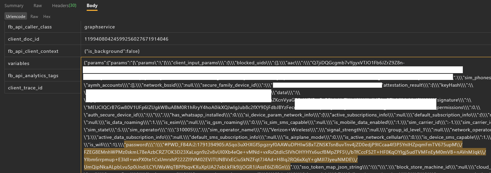

# Facebook Password Encryption

## Foundation
After bypassing the [Facebook SSL Pinning](https://github.com/zokieer/Facebook-SSL-Pinning-Bypass) done. I found the `#PWD_FB4A` string when Facebook app was sending login request.



`password = #PWD_FB4A:2:<timestamp>:<base64(blob)>`

---

## Memory Scanning


I realize using `frida-trace` without any information about target is an ******* dumb way to get mad. Then:

```javascript
Process.enumerateModules().forEach(m => {
    Memory.scan(m.base, m.size, '23 51 56 44 5f 46 42 34 41', {   // "#PWD_FB4A"
        onMatch: a => console.log(m.name),
        onComplete: () => {}
    });
});
```
→ z-a9f6cfb374975a5f2bec423a042a6d157bedef8f.vdex
## Encryption Process

Reading the bytecode in that vdex (class `LX/97s`, method `encryptPasswordAndFormat`), the actual crypto is a native call:

```
com.facebook.cryptopub.CryptoPubNative.encryptNative(keyId, pubKeyPEM, password, timestamp) -> byte[]
```


**`blob` structure** (e.g. a 6-char password → 294 bytes):

| Offset | Len | Field |
|---|---|---|
| 0 | 1 | version = `0x01` |
| 1 | 1 | keyId |
| 2 | 12 | GCM nonce (random) |
| 14 | 2 | len(enc_key), little-endian = 256 |
| 16 | 256 | AES key encrypted with the server RSA public key |
| 272 | 16 | GCM tag |
| 288 | N | ciphertext (= password length) |


The public key (RSA-2048) and keyId come from `PasswordEncryptionKeyFetchMethod`.

---

Extremely powered by Frida (and Claude lol).
